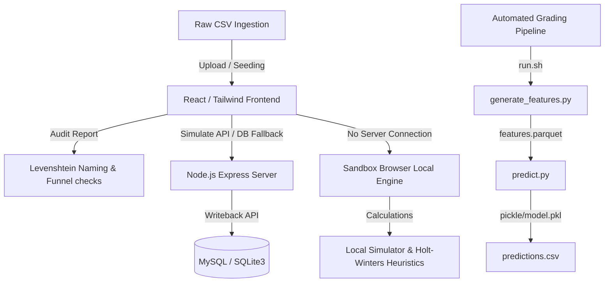

# AI Revenue & ROAS Forecasting Utility for E-commerce Marketing

This repository contains the source code, pre-trained model pipelines, and system documentation for the **Probabilistic Revenue Forecasting Utility**, designed for digital marketing agencies to forecast future e-commerce Revenue and ROAS.

---

## 🚀 Grading & Pipeline Execution (NetElixir Guide)

An automated Python forecasting pipeline is located at the root of the repository, complying with grading guidelines:

### 1. Prerequisite Packages
Install dependencies from `requirements.txt`:
```bash
pip install -r requirements.txt
```

### 2. Model Training & Compilation
To generate the baseline test dataset and train the default Random Forest model artifact:
```bash
python src/train_model.py
```
This writes raw logs to `data/historical_data.csv` and serializes the Scikit-Learn pipeline to `pickle/model.pkl`.

### 3. Automated Prediction Execution
The scoring pipeline executes `run.sh`, passing three positional arguments:
```bash
./run.sh <DATA_DIR> <MODEL_PATH> <OUTPUT_PATH>
```
*   **Example run:** `./run.sh ./data ./pickle/model.pkl ./output/predictions.csv`
*   The script runs end-to-end: aggregating daily features, saving a tabular `features.parquet`, loading the model, calculating 95% confidence intervals, and writing predictions to `predictions.csv`.

---

## 💻 Tech Stack & Architecture



### Frontend Web Console
*   **Framework:** React 18, TypeScript, Tailwind CSS.
*   **Icons & Plots:** Lucide Icons, Recharts curve charts.
*   **Audit Engine:** Built-in Levenshtein validator checking platform misalignment and funnel anomalies in uploaded campaigns.
*   **Attribution Matrix:** Interactive toggle grids displaying spends, revenues, expected ROAS, and min/max ranges for Channels, Campaign Types, and Campaigns.

### Backend Server
*   **Framework:** Node.js, Express API, TypeScript.
*   **Database:** Dual-mode data Layer: attempts to connect to MySQL; falls back to an embedded local SQLite file database (`forecast_ai.db`) if MySQL configuration is absent.
*   **Sandbox Fallback:** If the frontend is run standalone (server offline), it enters sandbox mode—executing ML algorithms, curve simulations, report generation, and AI recommendations locally inside the browser.

---

## 🛠 Running the Application Locally

### Start Backend API Server
```bash
cd backend
npm install
npm run dev
```

### Start Frontend Console
```bash
cd frontend
npm install
npm run dev
```
Open `http://localhost:5173` to interact with the dashboard.
